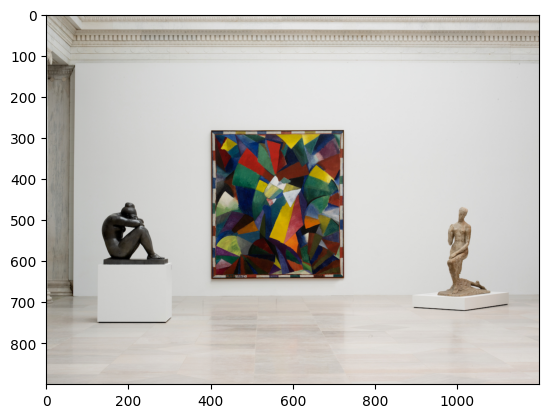
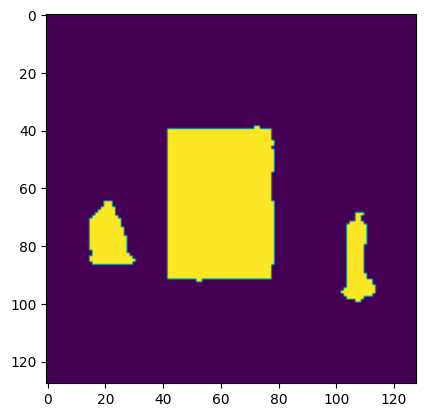
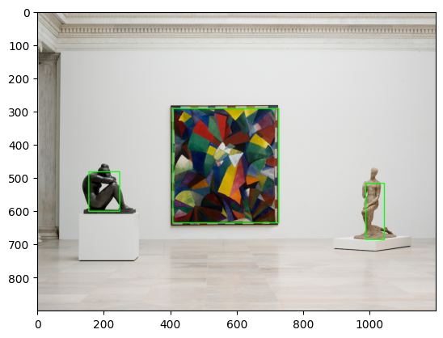
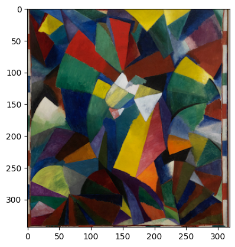

# Component Cropper approach

For this, it is first preferable to use an image where the artwork is the center, as it will be used to select it:

  

A [huggingface segmenter](https://huggingface.co/nvidia/segformer-b0-finetuned-ade-512-512) was used to separate the objects:

  

Then, connected components, their centroids and bounding boxes are calculated. From these, the largest and most centered is chosen.

  

With the chosen component, the image is cropped and a result is returned:

  

