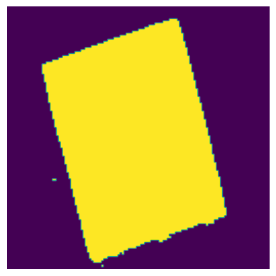
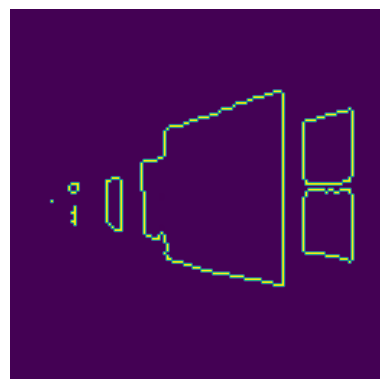

# Image Croper Module

This module is in charge of cropping and adjust the image to the object of interest, in this case it is a painting. In case there is no painting, it returns the original image.
The legacy cropper description based on component can be found [here](CCROPER.md).
For more information, read this [medium post](https://medium.com/@mjason98/paintings-extraction-from-images-art-guide-6002a749593e) about this module.


For this, it is first preferable to use an image where the artwork is the center, as it will be used to select it.
A [huggingface segmenter](https://huggingface.co/nvidia/segformer-b0-finetuned-ade-512-512) was used to separate the objects:


<table>
  <tr>
  <td>Rotated</td> <td>In Perspective</td> <td>Normal</td>
  </tr>
  <tr>
    <td></td>
    <td></td>
    <td></td>
  </tr>
  <tr>
  <td>
    Segmentation with NN (using the hugging face model)
  </td>
  </tr>
  <tr>
    <td></td>
    <td></td>
    <td></td>
  </tr>
  <tr>
  <td>
    Contour (using opencv)
  <td>
  </tr>
  <tr>
    <td></td>
    <td></td>
    <td></td>
  </tr>
  <tr>
  <td>
    Fiting a 4-side poligon (opencv + our heuristics)
  </td>
  </tr>
  <tr>
    <td></td>
    <td></td>
    <td></td>
  </tr>
  <tr>
  <td>
    Apply distortion/angle/size transformation ( :) )
  </td>
  </tr>
  <tr>
    <td></td>
    <td></td>
    <td></td>
  </tr>
</table>

### Implementation Details

The proportion issue:

<table>
  <tr>
  <td>Original</td> <td>only distortion</td> <td>with aspect ratio</td>
  </tr>
  <tr>
    <td></td>
    <td></td>
    <td></td>
  </tr>
  <tr>
</table>

To solve this, a way was found to take into account polygon rotation and aspect ratio at the same time. The four points of the polygon are taken and the covariance matrix is calculated. Then to this 2x2 matrix, the eigenvalues are found, with which the aspect ratio is calculated.

## Technical details

It was used opencv and huggingface modules to archive the current results.


Three tests were created

 * One proves that the croper works
 * One uses approximately 100 images that **should be cropped**, and only passes if more than **90%** pass.
 * One uses approximately 100 images that **should not be cropped** and only passes if less than **10%** are cropped.


to run the 3 tests, in the root folder:
```shell
source venv/bin/activate
pytest image_crop_module
```


### Future steps and improvements

The segmentation module will need to be improved in the future.
Since the current one only works with low resolution, it can happen that
the result of segmentation sticks to other objects and does not define the
edges well and more than one painting is selected.


<table>
  <tr>
    <td></td>
    <td></td>
    <td></td>
  </tr>
</table>


