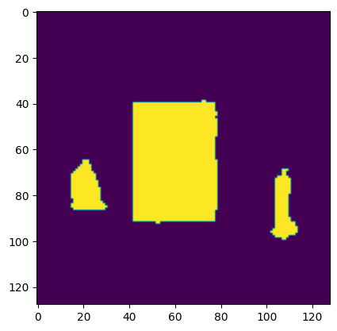
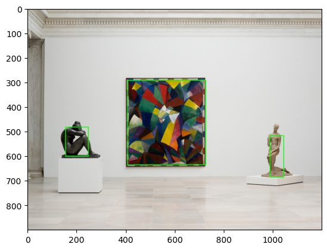

# Image Croper Module

This module is in charge of cropping the image to the object of interest, in case it is a painting, a buckaroo or a statue. In case there is no image, it returns the image.

For this, it is first preferable to use an image where the artwork is the center, as it will be used to select it:

A [huggingface segmenter](link) was used to separate the objects:

Then, connected components, their centroids and bounding boxes are calculated. From these, the largest and most centered is chosen.

With the chosen component, the image is cropped and a result is returned:

## Technical details

It was used opencv and huggingface modules to archive the current results.
An erosion operation was used to separate the components before the centroids calculations but in some cases the results are not good.

### Future steps and improvements

The segmentation module will need to be improved in the future. The current one does not detect some objects in the dataset such as vessels or art.

